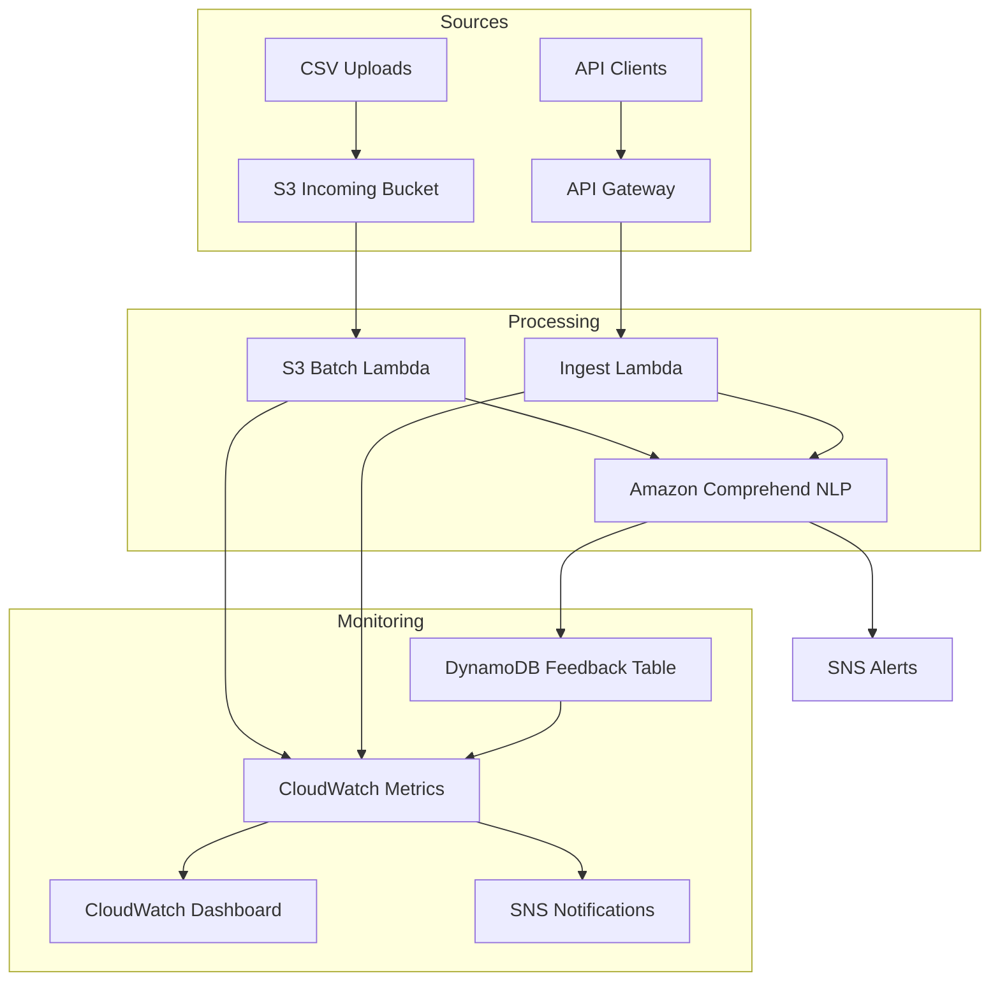

# Project 9 – AWS AI Feedback Triage

## Architecture Documentation

### Business Context

Companies collect large volumes of unstructured customer feedback through multiple channels (API submissions, CSV batch uploads, etc.).

This project demonstrates how to automatically **ingest, analyze, and triage** feedback using **AWS AI services** and **serverless infrastructure** — all within **AWS Free Tier**.

Employers will recognize this as a production-grade, resume-ready design that balances **business impact** with **technical depth**.

### High-Level Architecture

### Data Flow

1. **Ingestion**
   - **Real-time feedback**: Clients POST /feedback via API Gateway → Ingest Lambda
   - **Batch feedback**: CSV uploaded to S3 → triggers S3 Batch Lambda

2. **AI/NLP Processing**
   - Both Lambdas call **Amazon Comprehend** to detect:
     - Language
     - Sentiment (POSITIVE/NEGATIVE/NEUTRAL/MIXED)
     - Key phrases & entities

3. **Storage**
   - Results are normalized into DynamoDB with keys:
     - `pk = cust#<id>`
     - `sk = msg#<uuid>`
   - Includes raw payload, sentiment, and NLP analysis

4. **Alerts**
   - SNS sends email alerts for negative sentiment or Lambda errors
   - Subscriptions can scale to Slack, PagerDuty, or SMS

5. **Monitoring**
   - CloudWatch Dashboards track Lambda invocations, errors, latency
   - Alarms trigger via SNS on error thresholds

### AWS Services Used

| Service | Role in System |
|---------|----------------|
| API Gateway | Secure HTTP endpoint for real-time feedback ingestion |
| Lambda | Stateless serverless compute for API + S3 batch processing |
| S3 | Ingestion bucket for CSV batch uploads |
| Comprehend | Managed NLP: sentiment, key phrases, entities |
| DynamoDB | Low-latency NoSQL storage for feedback records |
| SNS | Notification fanout (email alerts) |
| CloudWatch | Monitoring, metrics, dashboards, alarms |

### Security & Cost Awareness

#### Security
- **IAM least privilege**: Lambdas restricted to only the DynamoDB table, Comprehend, and S3 bucket

#### Cost Optimization (Free Tier friendly)
- Lambda ≤ 1M requests/month free
- DynamoDB PAY_PER_REQUEST billing
- Comprehend free tier: 50K units/month
- SNS email alerts are free
- CloudWatch metrics/dashboards within free tier